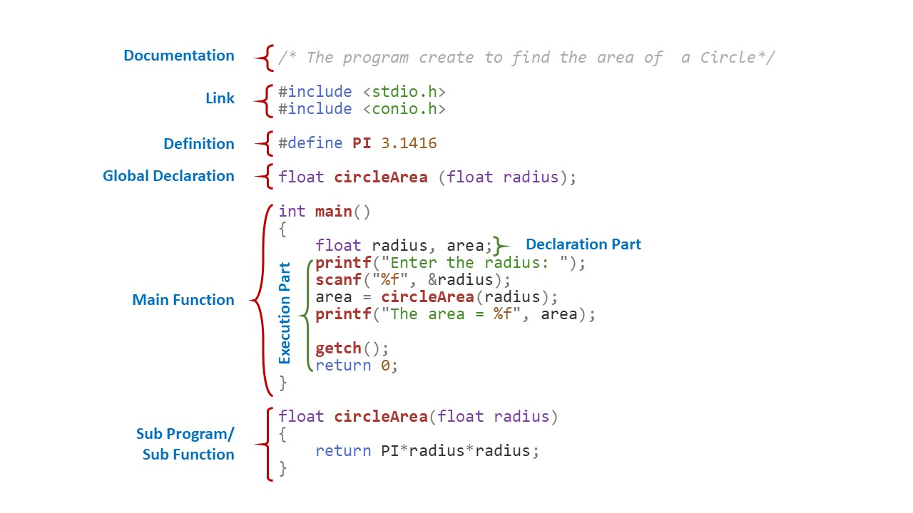
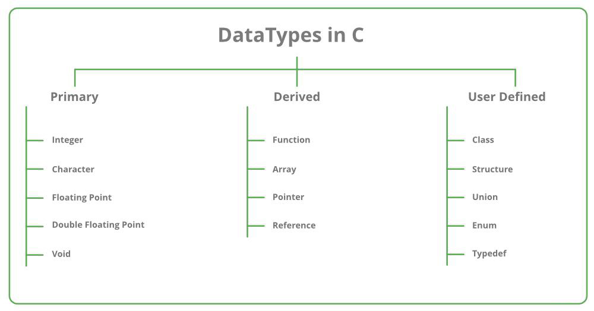
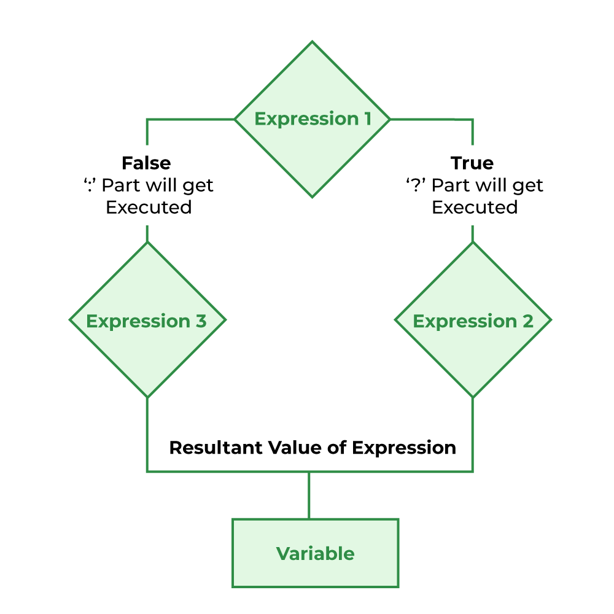
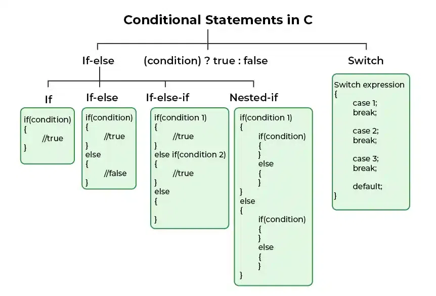
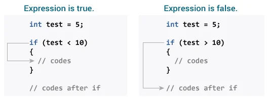
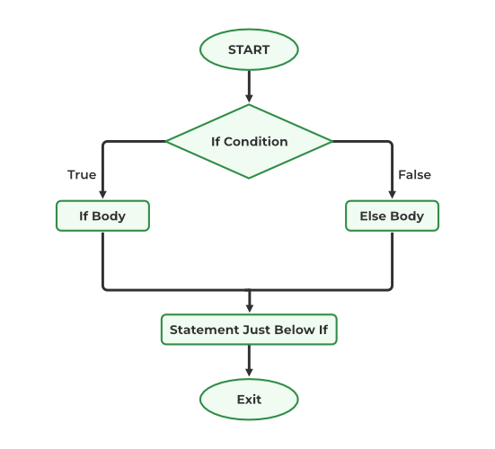
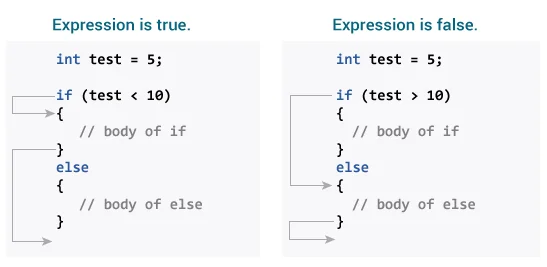
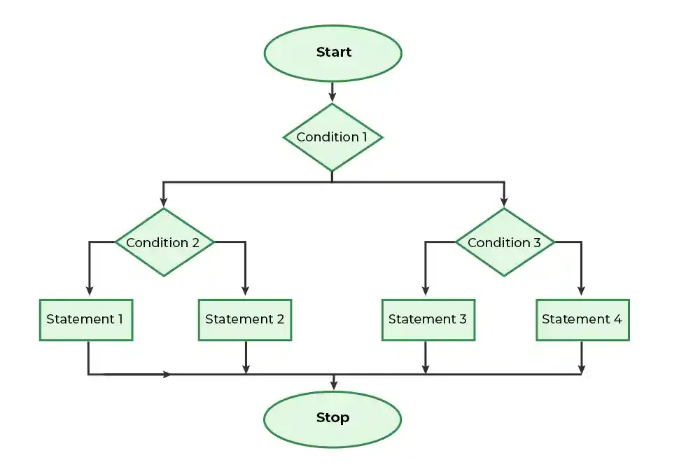

# C Programming Learning


<details>

<summary><b>C Programming Introduction:</b></summary>


C is a general-purpose, procedural programming language developed by Dennis Ritchie at Bell Labs in the early 1970s. It was designed to be a systems programming language but has since been used for a wide range of applications, including operating systems, compilers, embedded systems, and application software.

## <b>Getting Started With C Programming:</b>

+ <b>Set up Environment:</b>
  Install an Integrated Development Environment (IDE) such as Code::Blocks, Dev-C++, or Visual Studio Code with appropriate C extensions.
+ <b>Start with Simple Program:</b>

    ```c
    #include <stdio.h>

    int main() {
        printf("Hello, World!\n");
        return 0;
    }
    ```
Example:
```c
#include <stdio.h>
#include <string.h>

int main() {
    char name[100];
    char fatherName[100];
    char address[100];

    printf("Enter your name: ");
    scanf("%[^\n]",name);
    getchar();
    // fgets(name, sizeof(name), stdin);
    // gets(name);

    printf("Enter your father's name: ");
    // fgets(fatherName, sizeof(fatherName), stdin);
    scanf("%[^\n]",fatherName);
    getchar();
    //gets(fatherName);

    printf("Enter your address: ");
    // fgets(address, sizeof(address), stdin);
    scanf("%[^\n]",address);
    getchar();
    //gets(address);

    // Removing newline characters if present
    //name[strcspn(name, "\n")] = '\0';
    //fatherName[strcspn(fatherName, "\n")] = '\0';
    //address[strcspn(address, "\n")] = '\0';

    // Printing the entered details
    printf("\nEntered details:\n");
    printf("Name: %s\n", name);
    printf("Father's Name: %s\n", fatherName);
    printf("Address: %s\n", address);

    return 0;
}

```

</details>

<details>

<summary><b>Input & Output(I/O) in C Programming</b></summary>

Input and output operations in C programming are typically performed using the stdio.h library, which provides functions for reading input from the user (stdin) and writing output to the screen (stdout).

### <b>Input:</b>
---
The <code>scanf()</code> method, in C, reads the value from the console as per the type specified. 

<b>Syntax:</b>

```c
scanf(“%X”, &variableOfXType);
```

where %X is the format specifier in C. It is a way to tell the compiler what type of data is in a variable and & is the address operator in C, which tells the compiler to change the real value of this variable, stored at this address in the memory.

<b>Input Format:</b>

```c
int     --> scanf("%d", &variableName);
float   --> scanf("%f", &variableName);
char    --> scanf("%c", &variableName); //for single character
            scanf("%s", variableName); //for string
```

There are several method to reading character and string in C.

+ <code>getchar():</code> Used to read a single character from the standard input (stdin).<b>Example:</b>
  
  ```c
    char ch;
    ch = getchar();
  ```
+ <code>gets():</code> Used to read a string from the standard input (stdin). (Note: This function is unsafe and should be avoided due to buffer overflow vulnerabilities.)<b>Example:</b>
  
  ```c
    char str[50];
    printf("Enter a string: ");
    gets(str);
  ```

+ <code>fgets():</code> Used to read a string from the standard input (stdin) along with specifying the maximum number of characters to read.
  
  ```c
    char str[50];
    printf("Enter a string: ");
    fgets(str, sizeof(str), stdin);
  ```

+ <code>scanset:</code> When we used scanset <code>%[^\n]s</code> that time after reading the input we need to used <code>getchar()</code>, because it clear the input buffer. Otherwise we don't get the second input.

  ```c
    #include <stdio.h>

    int main()
    {

        char str[20];
        char str2[20];

        printf("Enter string: ");
        scanf("%[^\n]s", str);
        getchar();

        printf("Enter string2: ");
        scanf("%[^\n]s", str2);
        getchar();

        printf("%s", str);
        printf("%s", str2);

        return 0;
    }

  ```

### <b>Output:</b>
---
<code>printf()</code> Used for formatted output. It displays the output on the screen.

<b>Syntax:</b>

```c
printf(“%X”, variableOfXType);
```

where %X is the format specifier in C. It is a way to tell the compiler what type of data is in a variable and & is the address operator in C, which tells the compiler to change the real value of this variable, stored at this address in the memory.

<b>Output Format:</b>

```c
int     --> printf("%d", variableName);
float   --> printf("%f", variableName);
char    --> printf("%c", variableName);
            printf("%s", variableName); //for string
```

<b>Example:</b>

```c
#include <stdio.h>    
int main()
{ 
    int testInteger = 5;
    printf("C Programming");

    printf("Number = %d", testInteger);
    return 0;
}
```

</details>

<details>
<summary><b>General Structure of C Program</b></summary>

### <b>There are 6 section of C Programming:</b>
---

1. Documment Section
2. Link Section
3. Definition Section
4. Global Declaration Section
5. Main Function Section
6. Sub Program/ Sub function Section



<b>Document Section:</b></br>
The section that contain different information about the program using comment.. Comments are always ignored by compiler.

```c
// This is single line comment
/* This is Multiline comment*/
```

<b>Link Section:</b></br>
The section that contains the header files of the pre-defined functions that are being used in the program.

```c
#include  //This is the link section
```

<b>Definition Section:</b></br>
The section where different symbolic contants are defined is called Definition Section.
</br><b>Note:</b> This is optionl section.

```c
//Syntax:
#define identifierName value

//Example
#define PI 3.1416
```
<b>Global Declaration:</b></br>
The section that contains declaration of global variables and /or user defined functions. Global variables always declare between Definition section and Main Function Sections.

<b>Main Function Section:</b></br>
The section that contains the definition of main functions. This section can be divided into two parts and can be describe as:</br>

+ Declaration Part
+ Execution Part

<b>Sub Program Section:</b></br>
The section that contains the definitions of user defined functions.

</details>

<details>

<summary><b>Token in C</b></summary>
The smallest part of a C programming is called Token. The tokens of C language can be classified into six types based on the functions they are used to perform. The types of C tokens are as follows:


### <b>Keyword in C Programming</b>
---
The predefined reserved words of C Programming that have specific meaning for compiler are called keyword of C Programming. Keywords are part of the syntax and they cannot be used as an identifier. There are 32 keywords in C programming.

| Keywords  | Keywords  | Keywords  | Keywords  |
|-----------|-----------|-----------|-----------|
| auto      | double    | int       | struct    |
| break     | else      | long      | switch    |
| case      | enum      | register  | typedef   |
| char      | extern    | return    | union     |
| continue  | for       | signed    | void      |
| do        | if        | static    | while     |
| default   | goto      | sizeof    | volatile  |
| const     | float     | short     | unsigned  |

### <b>Identifier in C Programming</b>
---
Identifiers refer to the names of variables, functions, and arrays.
<b>Rules of Identifer:</b>

+ First character must be an alphabet or underscore(_).
+ Can only consists of letter, digit and underscore(_).
+ First 31 character are significant.
+ Cannot use keyword as Identifier.
+ Must not contain white space.

There are Two types of Identifiers:
+ Valid
+ Invalid


<b>Examples of Valid Identifiers:</b>

```c
int count;
float _total;
char MyVariable;
double average_score;
void calculateSum();
int num123;
float discount_rate;
```

<b>Examples of Invalid Identifiers:</b>

```c
int 123abc; // starts with a digit
float my-variable; // contains hyphen
char while; // keyword used as an identifier
double $price; // contains special character
char long variable; // contains space
```

### <b>Constant in C Programming</b>
---
The constants refer to the variables with fixed values. They are like normal variables but with the difference that their values can not be modified in the program once they are defined.

<b>Types of Constant:</b>
Primarily, there are three types of Constant:

+ Integer Constant --> -1,2,4,6
+ Real Constant --> 10.00, 23.50
+ Character Constant --> 'a','$'

### <b>String in C Programming</b>
---
Strings are nothing but an array of characters ended with a null character (‘\0’). This null character indicates the end of the string. Strings are always enclosed in double quotes.

```c
char string[20] = {'a','b', '\0'};
char string[20] = "programming";
char string [] = "programming";
```

### <b>Operator in C Programming</b>
---
Operators are symbols used to perform operations on operands. They include arithmetic operators (+, -, *, /, %), relational operators (==, !=, <, >, <=, >=), logical operators (&&, ||, !), assignment operators (=, +=, -=, *=, /=), etc.

### <b>Special Symbols in C Programming</b>
---
Symbols include various symbols used for punctuation and separation within the program. Examples include semicolons (;), commas (,), parentheses (()), braces ({}), brackets ([]), etc.


</details>

<details>

<summary><b>Variable in C Programming</b></summary>

### <b>Variable in C Programming</b>
---
Variable is the name of a memory location which stores some data. It is a container. Each variable has a specific data type, which determines the type of data it can hold (such as integers, floating-point numbers, characters, etc.)

<b>Syntax of declaring a variable:</b>
```c
data_type variable_name;
data_type variable_name = value;
```
<b>Example:</b>

```c
int num = 10;
char grade = 'A';
float point = 3,5;
```
<b>Rules of Variable Names:</b>

+ Names can contain letters, digits and underscores
+ Names must begin with a letter or an underscore (_)
+ Names are case-sensitive (myVar and myvar are different variables)
+ Names cannot contain whitespaces or special characters like !, #, %, etc.
+ Keywords (such as int) cannot be used as names

<b>There are 3 aspects of defining a variable:</b>

+ Variable Declaration
+ Variable Definition
+ Variable Initialization

</details>

<details>
<summary><b>Data Type in C Programming</b></summary>

### <b>Data Type</b>
---
Data types specify the type of data that variables can hold. Each data type has a specific range of values and memory representation.

<b>There are three kinds of Data Types:</b>

+ <code>Primary Data Types:</code> The pre-defined data type given in C is called Primary data type. such as integers, float, characters, etc.
+ <code>Derived Data Types:</code> The user-defined data types are defined by the user himself.
+ <code>User-Defined Data Types:</code> The data types that are derived from the primitive or built-in datatypes are referred to as Derived Data Types.



### Range & Size of Data Types:
---
Different data types also have different ranges up to which they can store numbers. These ranges may vary from compiler to compiler. Below is a list of ranges along with the memory requirement and format specifiers on the 32-bit GCC compiler.

| Data Type              | Size (bytes) | Range                               | Format Specifier |
|------------------------|--------------|-------------------------------------|------------------|
| short int              | 2            | -32,768 to 32,767                   | %hd              |
| unsigned short int    | 2            | 0 to 65,535                         | %hu              |
| unsigned int           | 4            | 0 to 4,294,967,295                  | %u               |
| int                    | 4            | -2,147,483,648 to 2,147,483,647     | %d               |
| long int               | 4            | -2,147,483,648 to 2,147,483,647     | %ld              |
| unsigned long int     | 4            | 0 to 4,294,967,295                  | %lu              |
| long long int          | 8            | -(2^63) to (2^63)-1                 | %lld             |
| unsigned long long int | 8            | 0 to 18,446,744,073,709,551,615     | %llu             |
| signed char            | 1            | -128 to 127                         | %c               |
| unsigned char          | 1            | 0 to 255                            | %c               |
| float                  | 4            | 1.2E-38 to 3.4E+38                  | %f               |
| double                 | 8            | 1.7E-308 to 1.7E+308                | %lf              |
| long double            | 16           | 3.4E-4932 to 1.1E+4932              | %Lf              |

<b>To find the range of data types in C Programming:</b>

```c
#include <stdio.h>
#include <limits.h>

int main() {
    printf("Range of char: %d to %d\n", CHAR_MIN, CHAR_MAX);
    printf("Range of unsigned char: 0 to %d\n", UCHAR_MAX);
    printf("Range of short: %d to %d\n", SHRT_MIN, SHRT_MAX);
    printf("Range of unsigned short: 0 to %u\n", USHRT_MAX);
    printf("Range of int: %d to %d\n", INT_MIN, INT_MAX);
    printf("Range of unsigned int: 0 to %u\n", UINT_MAX);
    printf("Range of long: %ld to %ld\n", LONG_MIN, LONG_MAX);
    printf("Range of unsigned long: 0 to %lu\n", ULONG_MAX);
    printf("Range of long long: %lld to %lld\n", LLONG_MIN, LLONG_MAX);
    printf("Range of unsigned long long: 0 to %llu\n", ULLONG_MAX);

    return 0;
}

```

<b>To find the size of data types in C Programming:</b>

```c
#include <stdio.h>

int main() {
    printf("Size of char: %zu bytes\n", sizeof(char));
    printf("Size of short int: %zu bytes\n", sizeof(short int));
    printf("Size of int: %zu bytes\n", sizeof(int));
    printf("Size of long int: %zu bytes\n", sizeof(long int));
    printf("Size of long long int: %zu bytes\n", sizeof(long long int));
    printf("Size of float: %zu bytes\n", sizeof(float));
    printf("Size of double: %zu bytes\n", sizeof(double));
    printf("Size of long double: %zu bytes\n", sizeof(long double));
    return 0;
}

```

</details>

<details>
<summary><b>Operators in C Programming</b></summary>

### <b>Operators:</b>
---
An operator is a symbol that tells the computer to perform certain mathematical or logical manipulations. Operator are used in programs to manipulate data and variables.

<b>There are several types of Operator in C Programming:</b>

+ Arithmetic Opeators --> <code>+ , - , * , / , % </code>
+ Realtional Operators --> <code>&& , || , ! </code>
+ Logical Operators --> <code>> , < , >= , <=</code>
+ Assignment Operators --> <code>=</code>
+ Increment/Decrement Operators --> <code>++ , --</code>
+ Conditional Operators --> <code>? , :</code>

### <b>Arithmetic Operators:</b>
---

| Operator | Meaning of Operator          |
|----------|------------------------------|
| +        | addition or unary plus       |
| -        | subtraction or unary minus   |
| *        | multiplication               |
| /        | division                     |
| %        | remainder after division     |

<b>Working of Arithmetic operators</b>

```c
#include <stdio.h>
int main()
{
    int a = 9,b = 4, c;
    
    c = a+b;
    printf("a+b = %d \n",c);
    c = a-b;
    printf("a-b = %d \n",c);
    c = a*b;
    printf("a*b = %d \n",c);
    c = a/b;
    printf("a/b = %d \n",c);
    c = a%b;
    printf("Remainder when a divided by b = %d \n",c);
    
    return 0;
}
```

### <b>Relational Operators:</b>
---

| Operator | Meaning of Operator         |
|----------|-----------------------------|
| ==       | Equal to                    |
| >        | Greater than                |
| <        | Less than                   |
| !=       | Not equal to                |
| >=       | Greater than or equal to    |
| <=       | Less than or equal to       |

<b>Working of Relational operators</b>

```c
#include <stdio.h>
int main()
{
    int a = 5, b = 5, c = 10;

    printf("%d == %d is %d \n", a, b, a == b);
    printf("%d == %d is %d \n", a, c, a == c);
    printf("%d > %d is %d \n", a, b, a > b);
    printf("%d > %d is %d \n", a, c, a > c);
    printf("%d < %d is %d \n", a, b, a < b);
    printf("%d < %d is %d \n", a, c, a < c);
    printf("%d != %d is %d \n", a, b, a != b);
    printf("%d != %d is %d \n", a, c, a != c);
    printf("%d >= %d is %d \n", a, b, a >= b);
    printf("%d >= %d is %d \n", a, c, a >= c);
    printf("%d <= %d is %d \n", a, b, a <= b);
    printf("%d <= %d is %d \n", a, c, a <= c);

    return 0;
}
```
<b>Output:</b>

```c
5 == 5 is 1
5 == 10 is 0
5 > 5 is 0
5 > 10 is 0
5 < 5 is 0
5 < 10 is 1
5 != 5 is 0
5 != 10 is 1
5 >= 5 is 1
5 >= 10 is 0
5 <= 5 is 1
5 <= 10 is 1 
```

### <b>Logical Operators:</b>
---
The logical operator are used when we want to test more than one condition and make decision.

| Operator | Meaning                 |
|----------|-------------------------|
| &&       | Logical AND             |
| \|\|     | Logical OR              |
| !        | Logical NOT             |

<b>Working of Logical operators</b>

```c
#include <stdio.h>

int main() {
    int c = 5, d = 2;

    // Logical AND (&&) operator
    printf("Logical AND:\n");
    printf("(%d == 5) && (%d > 5) evaluates to %d\n", c, d, (c == 5) && (d > 5));  // false (0)
    printf("(%d == 5) && (%d < 5) evaluates to %d\n", c, d, (c == 5) && (d < 5));  // true (1)

    // Logical OR (||) operator
    printf("\nLogical OR:\n");
    printf("(%d == 5) || (%d > 5) evaluates to %d\n", c, d, (c == 5) || (d > 5));  // true (1)
    printf("(%d == 5) || (%d < 5) evaluates to %d\n", c, d, (c == 5) || (d < 5));  // true (1)

    // Logical NOT (!) operator
    printf("\nLogical NOT:\n");
    printf("!(%d == 5) evaluates to %d\n", c, !(c == 5));  // false (0)
    printf("!(%d != 5) evaluates to %d\n", c, !(c != 5));  // true (1)

    return 0;
}

```

### <b>Assignment Operators:</b>
---
Assignment Operators are used to assign the resultof an expression to a variable. Main assignment operator <code>=</code>.

| Operator | Example | Same as     |
|----------|---------|-------------|
| =        | a = b   | a = b       |
| +=       | a += b  | a = a + b   |
| -=       | a -= b  | a = a - b   |
| *=       | a *= b  | a = a * b   |
| /=       | a /= b  | a = a / b   |
| %=       | a %= b  | a = a % b   |

<b>Syntax:</b>

```c
int a;  //-->Declaration
a = 10; //-->Assignment
int a = 10; //--> Initialigation
```
<b>Working of Assignment operators</b>

```c
#include <stdio.h>
int main()
{
    int a = 5, c;

    c = a;      // c is 5
    printf("c = %d\n", c);
    c += a;     // c is 10 
    printf("c = %d\n", c);
    c -= a;     // c is 5
    printf("c = %d\n", c);
    c *= a;     // c is 25
    printf("c = %d\n", c);
    c /= a;     // c is 5
    printf("c = %d\n", c);
    c %= a;     // c = 0
    printf("c = %d\n", c);

    return 0;
}
```

### <b>Increment & Decrement Operator</b>
---
Increment ++ increases the value by 1 whereas decrement -- decreases the value by 1.

<b>Working of increment and decrement operators</b>

```c
#include <stdio.h>
int main()
{
    int a = 10, b = 100;
    float c = 10.5, d = 100.5;

    printf("++a = %d \n", ++a);
    printf("--b = %d \n", --b);
    printf("++c = %f \n", ++c);
    printf("--d = %f \n", --d);

    return 0;
}
```

### <b>Conditional Operators</b>
---
The conditional operator in C is kind of similar to the if-else statement as it follows the same algorithm as of if-else statement but the conditional operator takes less space and helps to write the if-else statements in the shortest way possible. It is also known as the ternary operator in C as it operates on three operands.

Syntax:

```sql
condition ? expression1 : expression2
or
variable = expression1 ? expression2 : expression3
```


<b>Working of Conditional Statement:</b>

+ Step 1: If the Condition is True then Expression1 will be executed.
+ Step 2: If the condition is false then Expression2 will be executed.
+ Step 3: Results will be returned.



Example:

```c
#include <stdio.h>

int main()
{
    int num = 100, num2=20;
    int max = (num>num2) ? num : num2;
    printf("Maximum Number is: %d\n", max);
    
    return 0;
}
```

</details>

<details>

<summary><b>Conditional Statement in C Programming</b></summary>

Conditional statements in C programming are used to make decisions based on conditions. They are also known as Decision-Making Statements and are used to evaluate one or more conditions and make the decision whether to execute a set of statements or not.

### <b>Types of Conditional Statement:</b>
---
There are several types of conditional Statement:

+ if Statement
+ if-else Statement
+ Nested if..else Statement
+ if-else-if Ladder
+ switch Statement
+ Conditional Operators
+ Jump Statements:
  + break
  + continue
  + goto
  + return



### <b>if Statement in C:</b>
---
The <b>if</b> statement is used to execute a block of code if a specified condition is true.

<b>Syntax:</b>

```c
if(condition) 
{
   // Statements to execute if
   // condition is true
}
```

<b>Working of if Statement:</b>



<b>Example:</b>

```c
#include <stdio.h>
int main() {
    int number;

    printf("Enter an integer: ");
    scanf("%d", &number);
    if (number < 0) {
        printf("You entered %d.\n", number);
    }
    printf("The if statement is easy.");

    return 0;
}
```

### <b>if...else Statement in C</b>
---
The if-else statement is used to execute one block of code if a condition is true and another block of code if the condition is false.

<b>Syntax:</b>

```c
if (condition) {
    // Code to execute if condition is true
} else {
    // Code to execute if condition is false
}
```
<b>Flowchart of if...else Statement:</b>



<b>Working of if...else Statement:</b>



<b>Example:</b>

```c
// Check whether an integer is odd or even

#include <stdio.h>
int main() {
    int number;
    printf("Enter an integer: ");
    scanf("%d", &number);

    if  (number%2 == 0) {
        printf("%d is an even integer.",number);
    }
    else {
        printf("%d is an odd integer.",number);
    }

    return 0;
}
```

### <b>Nested if-else Statement in C</b>
---

<b>Flowchart of Nested if...else Statement:</b>



</details>

<details>
<summary><b>Practice Question</b></summary>

1. Find the Area of a Rectangle.
2. Find the area of a Circle.
3. Convert Temperature Celsius(C) to Fahrenheit(F)
4. Find the given number is Negative or Posative.
5. Find the area of Triangle
6. Find the maximum number from two numbers.
7. <code>If...else:</code>
   1. Diet Program. Take breakfast, lunch, dinner time as input from the user and find the diet. If time (breakfast=7, lunch=1, dinner=8) or (breakfast=8, lunch=2, dinner=9) then print "Right Diet" otherwise print "Wrong Diet".
   2. Eligible or Not Eligible for Marriage. If gender=male & age>=21 then print "Eligible for Marriage". If gender=female & age>=18 then print "Eligible for Marriage" otherwise "Not eligible for marriage".
   3. Create a Simple Calculator.
   4. Find the biggest number in three numbers.
   5. Take a input from user name weight. And do this:
      + 1-20 --> Light
      + 21-30 --> Medium
      + 31-60 --> Heavy
      + 61+ --> Extra Heavy.
   6. Calculate Electrical Bill

</details>